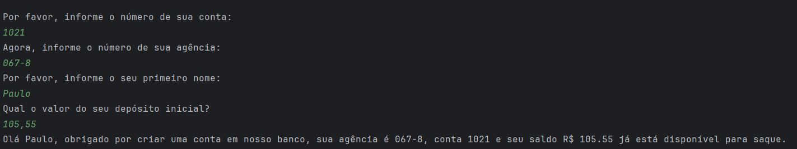

# Simulando Uma Conta Bancária Através Do Terminal/Console
Projeto em Java de interação via terminal para acesso aos dados de conta bancária.

## Funcionalidade
O Usuário irá interagir com o sistema via terminal informando seus dados.
Ao final, o sistema irá exibir a mensagem de finalização, informando os dados:

## Objetivo
Explorar opções de entrada e saída simples de dados em uma aplicação Java.
